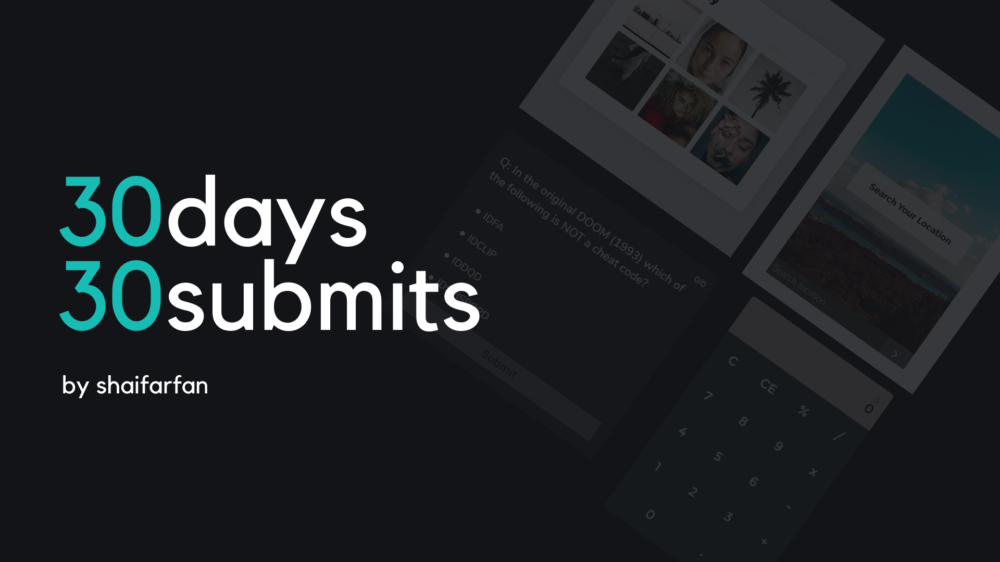

# 30days30submits

 ## This challenge is started on July 21, 2020 📅
 ### In this challenge a submitted 30 little to medium size projects. Sometimes I did a little website component or sometimes some javaScript app as a submit. I did it to boost my HTML, CSS & JS skills. Down here you will find all the live previews and youTube videos (how I made it). Also here is the full playlist for this #30days30submits challenge => [playlist](https://www.youtube.com/playlist?list=PLRv_Gd5w9e7m7wokXmB9fGtGYw100UKc0).

| day   | Project Name    | source Code/preview |                       YouTube Video       |
| :---  | :-------------: | ------------------: |  ---------------------------------------: |
| day-1 | Custom Cursor   | https://codepen.io/Web_Cifar/pen/OJMrzaB | https://youtu.be/de4W0EHMuUs |
| day-2 | Theme Switcher  | https://codepen.io/Web_Cifar/pen/OJMrdbq | https://youtu.be/D1yg4T37qYo |
| day-3 | Random Dad Jokes Generator | https://codepen.io/Web_Cifar/pen/XWXOZWX | https://youtu.be/UDIfuvLEkjU |
| day-4 | Numbers API     | https://codepen.io/Web_Cifar/pen/PoZLpoG | https://youtu.be/s3LFCErzmHI |
| day-5 | Countdown Timer | https://codepen.io/Web_Cifar/pen/OJMGPbb | https://youtu.be/_a4XCarxwr8 |
| day-6 | Featured Section| https://codepen.io/Web_Cifar/pen/WNrWxYG | https://youtu.be/L4k3_elYm2U |
| day-7 | Photo gallery p-1| https://codepen.io/Web_Cifar/pen/wvMbwdj | https://youtu.be/URymtcPO11A |
| day-8 | Photo gallery p-2 [Pexels API]| https://github.com/ShaifArfan/30days30submits/tree/master/day-8 | https://youtu.be/gGBpmzLN1Hw |
| day-9 | Read More Button| https://codepen.io/Web_Cifar/pen/OJMeVxx | https://youtu.be/TvVY8c1uvG8 |
| day-10 | key Code Generator App | https://codepen.io/Web_Cifar/pen/eYJwvKV | https://youtu.be/jOLwRV6xSwA |
| day-11 | CSS animated Menu | https://codepen.io/Web_Cifar/pen/eYJqdxy | https://youtu.be/q8vmz-R_3Ck |
| day-12 | CSS Flex Gallery | https://codepen.io/Web_Cifar/pen/wvMVmZN | https://youtu.be/Z6IZ2NOEzmw  |
| day-13 | Analog Clock | https://codepen.io/Web_Cifar/pen/LYNYmpb | https://youtu.be/6xEQ_jA5V2Y  |
| day-14 | Digital Clock | https://codepen.io/Web_Cifar/pen/MWyYaBP | https://youtu.be/gmNhRyxAPpw  |
| day-15 | BG Color Changer | https://codepen.io/Web_Cifar/pen/dyMPmwY | https://youtu.be/Yem8T8azZko  |
| day-16 | Basic Tooltips | https://codepen.io/Web_Cifar/pen/PoNqwNJ | https://youtu.be/MXRxahbJX3A  |
| day-17 | Scroll Down Button | https://codepen.io/Web_Cifar/pen/WNwvOaE | https://youtu.be/LY1jeQGUiAI |
| day-18 | Advance Tooltips | https://codepen.io/Web_Cifar/pen/yLOYoPR | https://youtu.be/e_jEquJo7y8 |
| day-19 | Full Functional Html Form | https://codepen.io/Web_Cifar/pen/gOrrPpO | https://youtu.be/vc9rgFHr098  |
| day-20 | Multi Step Form | https://codepen.io/Web_Cifar/pen/PoNNEYY | https://youtu.be/cKTgIDkRsGc  |
| day-21 | CSS Loading animation | https://codepen.io/Web_Cifar/pen/jOqqRPM | https://youtu.be/E_jOrp4t0N4  |
| day-22 | Food Recipe App | https://codepen.io/Web_Cifar/pen/oNxLYRY | https://youtu.be/x8EY0BlhPGk  |
| day-23 | Neon Light Effect | https://codepen.io/Web_Cifar/pen/MWyJENV | https://youtu.be/NLtUycloTnc  |
| day-24 | Speech Recognition App | https://codepen.io/Web_Cifar/pen/jOqBEjE | https://youtu.be/-k-PgvbktX4  |
| day-25 | Custom Slider | https://codepen.io/Web_Cifar/pen/bGpRwEr | https://youtu.be/V9TCxMMpGhI  |
| day-26 | Bouncing DVD logo | https://codepen.io/Web_Cifar/pen/JjXrLRJ | https://youtu.be/wMIARRCox9k  |
| day-27 | Quiz APP | https://codepen.io/Web_Cifar/pen/dyMZxNg | https://youtu.be/qXXM9nVxLWk  |
| day-28 | Simple Calculator | https://codepen.io/Web_Cifar/pen/XWdVgXr | https://youtu.be/0Vg4EiYPCUc  |
| day-29 | Weather APP | https://codepen.io/Web_Cifar/pen/gOrvMpR | https://youtu.be/y0iCeKUsYMk |
| day-30 | CSS Dot Loaders | https://codepen.io/Web_Cifar/pen/rNevXPx | https://youtu.be/ENa4y_-fJAs  |
